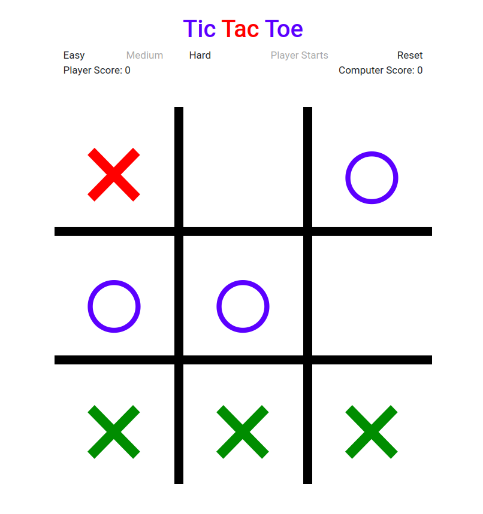

# Tic-Tac-Toe
Tic Tac Toe game using Flask framework. The AI has three modes of difficulty.
* Easy
* Medium
* Hard

Inside [logic.py](https://github.com/Abilityguy/Tic-Tac-Toe/blob/master/logic.py) 
is the code for different difficulty modes. Have fun!

##  Install
```
pip3 install -r requirements.txt
```
## Run
```
python3 app.py
```
and navigate to `http://localhost:5000/`

## Live Project
You can also play the game [here](https://ttt-ability-app.herokuapp.com/).


